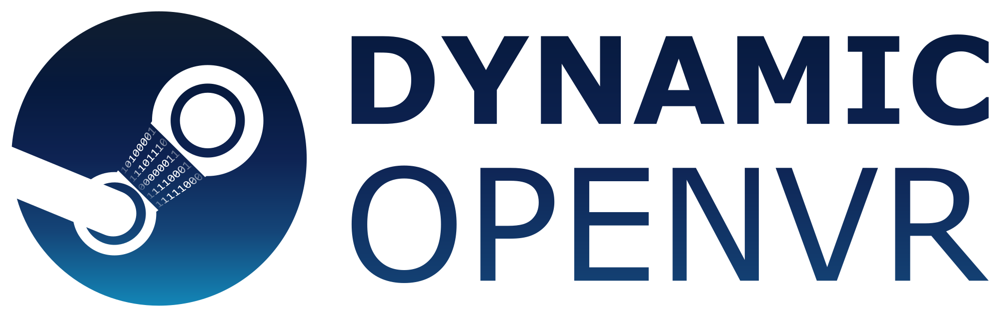

[](https://github.com/nicoco007/DynamicOpenVR/actions)
[](https://github.com/nicoco007/DynamicOpenVR/releases)
[](https://github.com/nicoco007/DynamicOpenVR/blob/master/LICENSE)

## What is DynamicOpenVR?

DynamicOpenVR is a set of Unity scripts that enables legacy games to use the new SteamVR action-based input system and allows multiple 3rd party developers to add new action-based inputs and outputs to a game without interfering with each other. It is built to seamlessly integrate with existing games that use either the legacy input system or the new action-based one.

### Why should I care?

DynamicOpenVR makes it easier for developers to add inputs to a game while allowing the user to customize how to trigger those inputs via SteamVR's powerful binding system. This removes the need for an additional layer of configuration and helps avoid hardcoding inputs to specific buttons.

## Installing
Download the latest release from [the releases page](https://github.com/nicoco007/DynamicOpenVR/releases) and extract **the entire contents** of the ZIP file into your Beat Saber folder (for Steam, this is usually `C:\Program Files (x86)\Steam\steamapps\common\Beat Saber`), **overwriting any existing files**.

## Troubleshooting
See [the troubleshooting guide](TROUBLESHOOTING.md).

## Using DynamicOpenVR in your game/mod
While there are currently no official instructions, you can take a look at the DynamicOpenVR.BeatSaber project in this repository for an implementation of DynamicOpenVR for Beat Saber (which uses the legacy input system, so lots of Unity XR input methods are being patched) and the [Beat Saber Custom Avatars](https://github.com/nicoco007/BeatSaberCustomAvatars) mod which uses finger tracking inputs.

## Contributing
To automatically copy the compiled DLLs into Beat Saber's installation directory, create a file called DynamicOpenVR.BeatSaber.csproj.user next to DynamicOpenVR.BeatSaber\DynamicOpenVR.BeatSaber.csproj and paste in the following:

```xml
<?xml version="1.0" encoding="utf-8"?>
<Project xmlns="http://schemas.microsoft.com/developer/msbuild/2003">
  <PropertyGroup>
    <!-- Replace this with the path to your Beat Saber installation -->
    <BeatSaberDir>C:\Program Files (x86)\Steam\steamapps\common\Beat Saber</BeatSaberDir>
  </PropertyGroup>
</Project>
```
