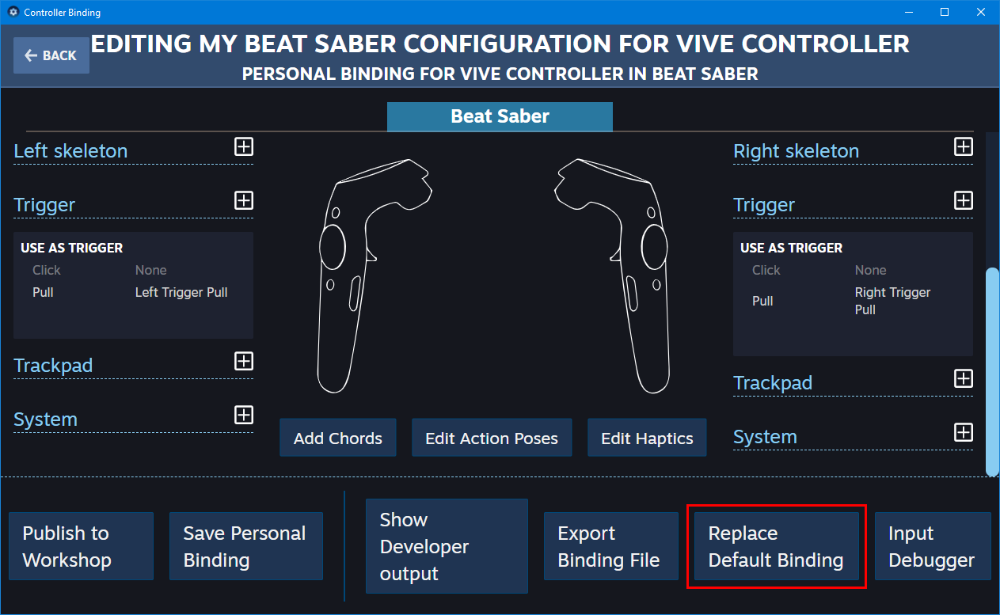

# Troubleshooting
## Buttons and/or tracking aren't working properly
*If this happens after uninstalling DynamicOpenVR, please see [Removing DynamicOpenVR](TROUBLESHOOTING.md#removing-dynamicopenvr).*

### Diagnosing issues with bindings
1. Start Beat Saber.
2. Open Controller Settings by clicking on the SteamVR menu button and choosing Devices > Controller Settings.
   
   

3. Click on Controllers, then Manage Controller Bindings.
   
   

4. Make sure Beat Saber is the selected game at the top of the window, and click on Custom next to Active Controller Binding.

   

5. You should now see which binding is currently being used by Beat Saber.
   * If it is called "Default Beat Saber Bindings," you should be getting input so something might not be right elsewhere.
   * If it is called "Default bindings for legacy applications for &lt;Your Controllers&gt;," DynamicOpenVR did not register properly. Try completely closing SteamVR and starting Beat Saber again. If the same binding is still there, please [open an issue](https://github.com/nicoco007/DynamicOpenVR/issues).
   * If the window is stuck on "Loading current binding..." or something else, then there are most likely no default bindings for the controllers you are currently using.

   If you can see the "Edit this Binding" button, skip to step 8. If not, proceed to the next step.

   

6. Close the binding management popup and click "Show" under "Advanced Settings" in the bottom left corner. You should now see the "Show Old Binding UI" button; press it.

   

7. In the window that opens, select "Beat Saber." It should be at the top of the list. Note that this step can be skipped if you already see the window from the next step.

   

8. Make sure the controllers you are currently using are selected.

   

9. Scroll all the way down until you see the "Create New Binding" button and press it.

   

10. You should now see the screen below. If you only see the "Add Chords" button (or if any of the buttons are missing), proceed to the next step. If not, skip to step 13.

   

11. Press the back button in the top right corner and select one of the following controllers:
    * Index Controller
    * Oculus Touch
    * Vive Controller
   
    For this guide, we will choose the Index Controller.

    

12. Press the "Edit" button under "Current Binding," then immediately go back, choose your own controller again, and scroll down to press the "Create New Binding" button once more.

    

    

13. Start configuring the binding. To add pose bindings, press the "Edit Action Poses" button. To add haptic bindings, press the "Edit Haptics" button.
 
    The default bindings use the following (note that the naming may be different depending on the controller type):
    * "Menu Button" &rarr; Menu Click
    * "Left Trigger Pull" &rarr; Left Trigger Pull
    * "Right Trigger Pull" &rarr; Right Trigger Pull
    * "Left Hand Pose" &rarr; Left Hand Raw
    * "Right Hand Pose" &rarr; Right Hand Raw
    * "Left Slice Haptic Feedback" &rarr; "Left Hand Haptics"
    * "Right Slice Haptic Feedback" &rarr; "Right Hand Haptics"

    

    

    

14. Once you are done, you can save your bindings by pressing "Save Personal Binding" at the bottom of the screen, entering a name and a description, and pressing the "Save" button. Note that it may take a few seconds for the binding to save and for the popup to close (don't press cancel!).

    

15. And there you go! Your bindings are now configured and you should be able to use in-game input properly. You can now close the settings windows and enjoy your game! If you would like to submit the bindings you just created to be included by default in DynamicOpenVR, go to the section below.

    

### Exporting bindings so they can be included by default in DynamicOpenVR

1. Open Controller Settings and make sure Advanced Settings are set to show (see above if necessary). Select "Developer" in the left-hand pane, turn "Enable debugging options in the input binding user interface" to ON, and press the "Restart SteamVR" button that appears afterwards.

    

2. After SteamVR has restarted, go once again to Controller Settings, select Controllers, press "Manage Controller Bindings."

   

3. Make sure Beat Saber is selected, press "Custom," and press "Edit Binding."

   

4. You should now once again see your binding. Press the "Replace Default Binding" that has appeared at the bottom of the screen.

    

5. A new file whose name starts with `steam_app_620980_binding_` followed by your controller name should have been created in the `DynamicOpenVR` folder in your Beat Saber installation folder (usually `C:\Program Files (x86)\Steam\steamapps\common\Beat Saber`). Attach that file to an issue, and you're good to go!

   
   

## Removing DynamicOpenVR
DynamicOpenVR generates files specific to your computer to improve user experience in SteamVR's interface. These files may cause issues after partially removing DynamicOpenVR. To completely uninstall DynamicOpenVR, make sure these files/folders no longer exist in Beat Saber's installation folder:

* Libs\DynamicOpenVR.dll
* Plugins\DynamicOpenVR.BeatSaber.dll
* DynamicOpenVR\
* beatsaber.vrmanifest

If you're still having issues after removing all of these, please [open an issue](https://github.com/nicoco007/DynamicOpenVR/issues).
